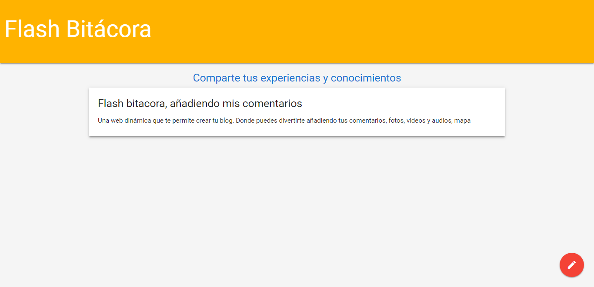

# FLASH BITÁCORA
Flash bitácora es una web dinámica creada para  publicar tus comentarios, fotos, videos y audios.
Para la realizacion de la web se uso el framework materialize. 

## Desarrollado para [Laboratoria](http://laboratoria.la) 

### HERRAMIENTAS:  
Las tecnologías que se usaron para crear nuestra web son:
- HTML 5
- CSS 3
- JQuery
- Javascript
- Materialize
- File API HTML5
- Geolocation API HTML5
- Audio y Vídeo API HTML5
- Date input API HTML5
### CONTENIDO:  
- Encontrara un FAB (Fixed Action Button) el cual al pasar el mouse por encima del boton desplegara los botones para realizar comentarios e insertar fotos, audios y videos.

Desarrolladoras: 
- Elizabeth Segura
- Daniela Gonzales